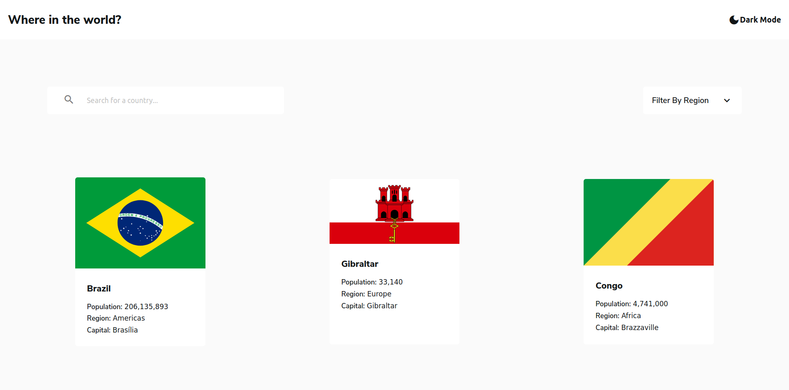
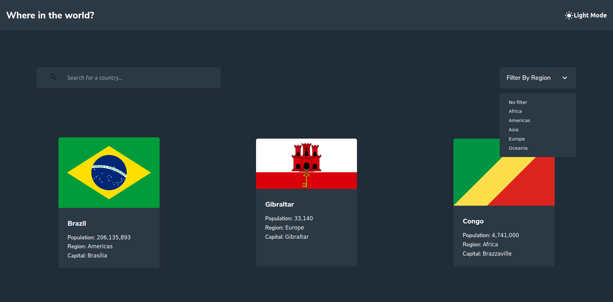

# Frontend Mentor - REST Countries API with color theme switcher

## Table of contents

- [Overview](#overview)
  - [The challenge](#the-challenge)
  - [Screenshot](#screenshot)
  - [Links](#links)
- [My process](#my-process)
  - [Built with](#built-with)
  - [What I learned](#what-i-learned)
  - [Continued development](#continued-development)
  - [Useful resources](#useful-resources)
- [Author](#author)

## Overview

### The challenge

Your challenge is to integrate with the [REST Countries API](https://restcountries.eu) to pull country data and display it like in the designs.

You can use any JavaScript framework/library on the front-end such as [React](https://reactjs.org) or [Vue](https://vuejs.org). You also have complete control over which packages you use to do things like make HTTP requests or style your project.

Your users should be able to:

- See all countries from the API on the homepage
- Search for a country using an `input` field
- Filter countries by region
- Click on a country to see more detailed information on a separate page
- Click through to the border countries on the detail page
- Toggle the color scheme between light and dark mode *(optional)*

Want some support on the challenge? [Join our Slack community](https://www.frontendmentor.io/slack) and ask questions in the **#help** channel.

### Screenshot

### Links

- [Solution](https://www.frontendmentor.io/solutions/react-with-styledcomponents-jVZGsVHLS)
- [Live Site](https://frontendmentorchallenge-restcountries.vercel.app/)

## My process

### Built with

- Semantic HTML5 markup
- CSS - Flexbox
- Mobile-first workflow
- [React](https://reactjs.org/) - JS library
- [Styled Components](https://styled-components.com/) - For styles
- [Figma](https://www.figma.com/) - For checking the design

### What I learned

- In this challenge I have learned how to make customized select inputs.
- I learned to use ThemeProvider from styled-components to make a switch that changes from dark to light mode.
- I created helpers for the requests to an API with fetch.

## Author

- Website - [Jorge Flagel](jorgeflagel.vercel.app/)
- Frontend Mentor - [@Jorge Flagel](https://www.frontendmentor.io/profile/jorgeflagel/solutions)
- LinkedIn - [@Jorge E. Flagel](https://www.linkedin.com/in/jorge-e-flagel-b2b372207/)

